##  CLAATU Tutorial
Welcome to a tutorial on ClaaTU. This page is under construction to provide a tutorial guide for ClaaTU. The goals of this tutorial is for you to be able to (quickly) understand the theory behind ClaaTU, as well as be able to apply ClaaTU as a tool to your own data. 

### What is CLAATU?
Claatu is a new bioinformatic tool created in the Sharpton lab (https://github.com/chrisgaulke/Claatu). You see our new paper which implements this tool here (add link here). The ClaaTU Algorithm allows us to discover *Cladal Taxonomic Units*, or CTUs. If you've worked doing any microbiome analysis before, you are familiar with an Operational Taxonomic Unit (OTU) table that are output by many softwares such as QIIME, Mothur, or an Amplicon Sequence Variant (ASV) table output by Dada2. ClaaTU can work with any of these common software outputs to discover CTUs in your data. 

### What is a CTU?
A CTU is simply a monophylitic clade of organisms within a phylogentic tree. A CTU can occur at any point along the phylogenetic tree: very close to the tree tips, or very deep within the tree. For the purposes of the tutorial, think of the tree tips as the OTU names. Think of nodes within the tree as CTU names.


### Why use CTUs?
Incorporating phylogeny into the assessment of how microbial lineages are distributed across communities can identify monophyletic clades of microbes that collectively manifest an association with ecological factors. For example, the clade highlighted in red in the image above is universally present across all mammalian microbiome samples, indicating that the clade may have evolved a conserved trait that facilitated its ubiquitous distribution. If we were to consider this relationship at the OTU level (i.e., considering the tips of the tree as appropriate units), the redundancy of OTUs within this clade would obscure the detection of this relationship. On the other hand, if we were to consider the genus level, the aggregation of this clade with others that do not possess the trait would similarly obscure this relationship. The ClaaTU (Cladal Taxonomic Units) workflow uses data files produced by third party microbiome analysis software (e.g., QIIME, Mothur, DADA2, etc.) to identify and quantify the abundance of specific clades in a user provided phylogenetic tree. This allows us to examine the abundance of clades across the input tree from tip to root. Currently, ClaaTU is run as a collection of scripts and a workflow is provided below.

<p align="center">
<kbd>
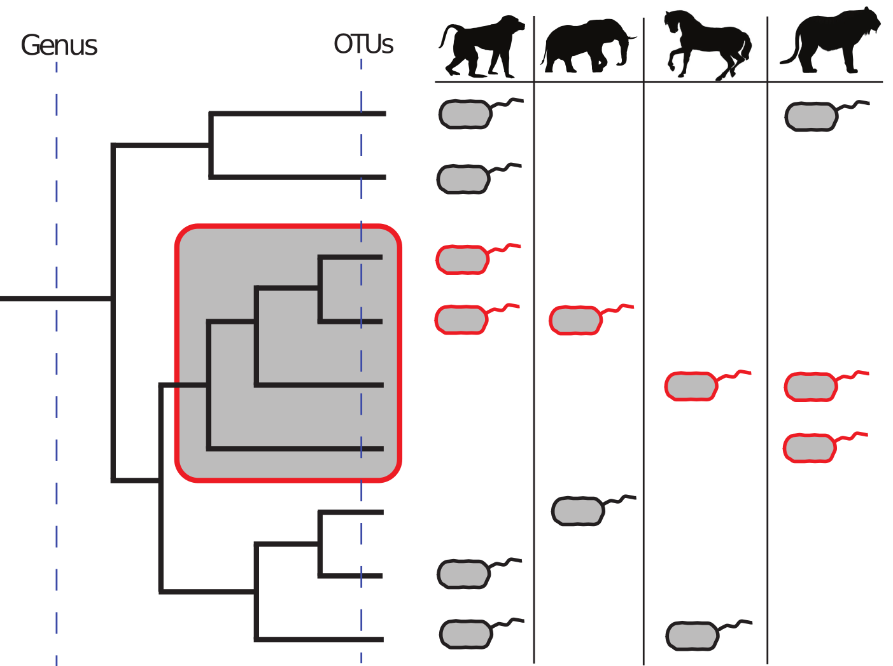
</kbd>
</p>

### ClaaTU Algorithm Overview
<p align="center">
<kbd>
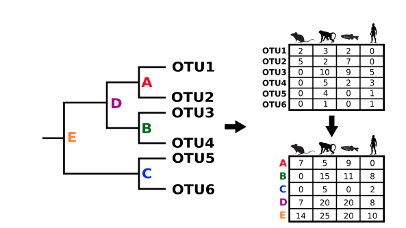
</kbd>
</p>
The idea behind ClaaTU is simple. ClaaTU uses two input files:
* An OTU or ASV table 
* A phylogenetic tree representing how OTUs (or ASVs) are related to one another.
* (Optional) a taxonomy file which labels each OTU with taxonomy

The output is a Cladal Taxonomic Unit Matrix m with the following properties:
* the row names correspond to the OTU sample names
* the column names correspond to each node of the phylogenetic tree.
* a m[i,j] corresponds to the sum of counts for each member of clade j found in sample i. 


### Install
First things first, lets install the software. 
```markdown
git git@github.com:arnold3/ClaaTU.git
```

### Dependencies
If you need to, you will have to install the following dependencies
1. [python (2.7.10)](https://www.python.org/downloads/)
2. [dendropy (4.0.2)](https://www.dendropy.org)
3. [scipy (0.13.0b1)](https://www.scipy.org/install.html)
4. [numpy (1.8.0rc1)](https://docs.scipy.org/doc/numpy/user/install.html)


### Files
Lets take a look at what the files are in the ClaaTU folder. Navigate to the location you downloaded Claatu to, then type: 
```markdown
cd Claatu-master
ls
```
You should see the following
```markdown
arc/  bin/  LICENSE.txt  test/  tutorialData/

```
Held within ```bin/``` are all the scripts which will carry out the Claatu algorithm. Held within `tutorialData/` are all of our tutorial files. This is where we are going to be working. Navigate to the `tutorialData` folder 
```markdown 
  cd tutorialData/
  ls
  bacteria.tre    otu.txt     map.txt     tax.txt

```
Here, we can see there are three files that you will need to run Claatu. Let's take a look at each one of them in a little more detail.


#### OTU Table

The first file that you will need is the OTU table that is output from QIIME. File format requirements:
- All entries must be tab separated.
- In standard QIIME output, there is text before the OTU table itself. To mark the beginning of the OTU table, QIIME adds a `#OTU ID` before the table. Yes, that is a `#OTU<space>ID<tab>`. This is important to note if you are not getting your OTU table from QIIME, but from another source.
- Column names are *sample IDs*
- Row names are *otu names*

So, now, lets take a look at our particular example:
```markdown
more otu.txt
```

<p align="center">
<kbd>
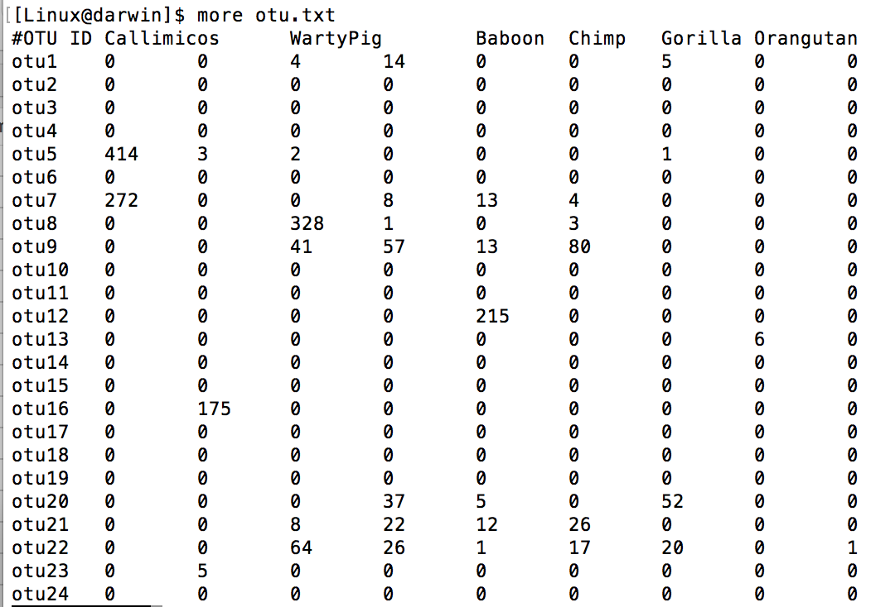
</kbd>
</p>


#### Bacterial tree
The second required file is a bacterial phylogenetic tree. File format requirements:
- newick format
- The tip labels must match the OTU labels in our otutable (`otu1, otu2, ... otuN`) exactly. Likewise, the names in the `.tre` file must exactly match those in the otu table.

```markdown
more bacterial.tre
```

<p align="center">
<kbd>
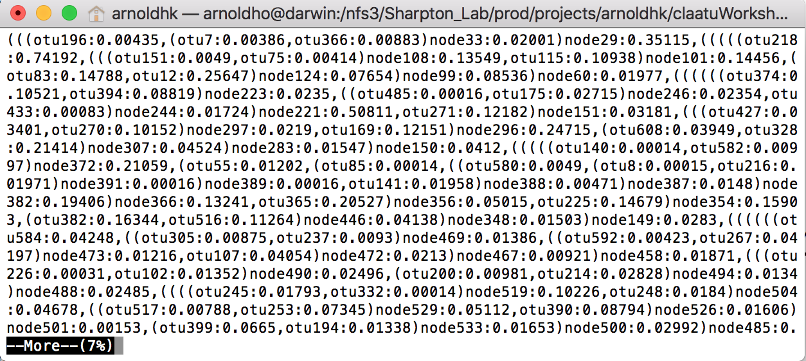
</kbd>
</p>

In our tutorial dataset, we see that we have a newick formated file, and that we have tree tips named similarly to the otu table. 

#### OTU Taxonomy table
Lastly, an optional file is the OTU taxonomy table. This is the standard QIIME output taxonomy table. We can see that rows are OTU names and columns are the taxonomy. 

<p align="center">
<kbd>
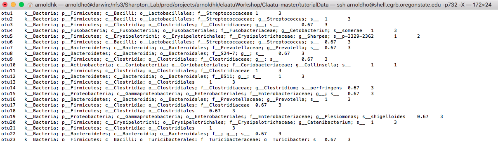
</kbd>
</p>

### Step 1: Prep phylogenetic tree (prep_tree.py)

Our first step is to prep the phylogenetic tree that we've created for use in the Claatu algorithm. This step performs several things:
1. Labels Nodes. `prep_tree.py` will label nodes of the tree. These will be in the format `n_i` where `i` is the node number. These will be our clade names. Nodes will be labeled in a pre-traversal order. That is, the current node will be labeled before any of the children of the current node are labeled. This means root will be labeled as 1.
2. Midpoint rooting (Optional). We have the option of midpoint rooting the phylogenetic tree. This is helpful for bacterial trees because there is no appropriate outgroup to root the bacterial tree. Considerations for your own data: if you do not wish to midpoint root, simply don't pass the -mid flag to `prep_tree.py`. 
3. Update Bipartitions (Optional). Using this argument, we update the internal splits hash representation of the phylogenetic tree in dendropy. This has a time cost, and is not automatically called. However, if you are going to do any futher calculations (i.e. comparing trees, calculating statistics on trees, etc. it is good to call this.) 
4. Bootstraps (Optional). If the tree has bootstrap values, you can read more [here](https://github.com/chrisgaulke/Claatu/blob/master/bin/prep_tree.py). Our tree does not have bootstraps, so we will pass the `-nbs` flag to indicate no bootstraps.

 
Lets go ahead and run the command now and look at the output files. This command has the form:

```markdown
python <path_to_ClaaTU/bin/prep_tree.py> <input_newick_tree.tre>
```

So we will type:
```markdown
python ../bin/prep_tree.py bacteria.tre -mid -up_bi -nbs
ls
```
This step creates two output files:
1. new_prepped_tree.tre
This is our new prepped tree with nodes labeled by dendropy. Lets go ahead and take a look at it:

<p align="center">
<kbd>
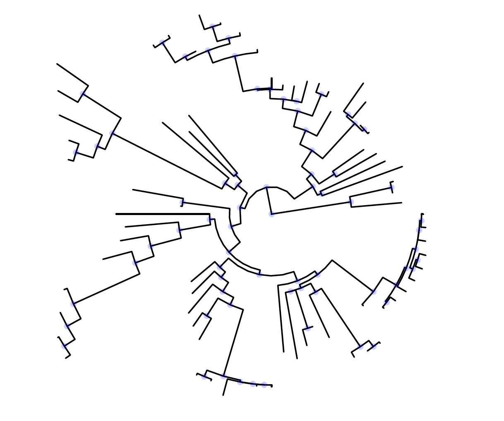
</kbd>
</p>

This is our bacterial tree. Each clade we are trying to get information on is labeled with a blue dot. Our `new_prepped_tree.tre` is now midpoint rooted. Additionally each parent only has two children, and each child only has one parent. Let's, take a closer look at the nodelabels on a subclade: 

<p align="center">
<kbd>
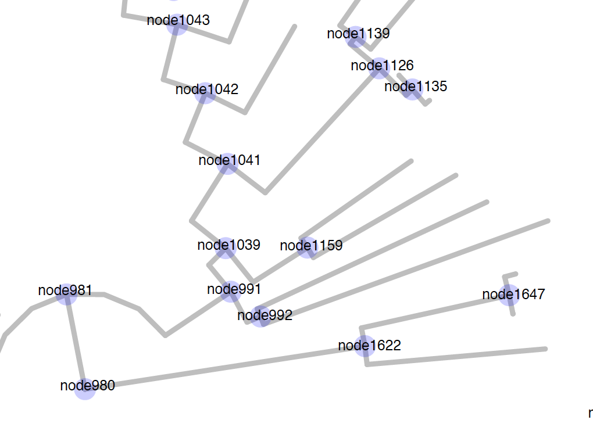
</kbd>
</p>

In Claatu, nodes are labeled by dendropy. We can see that dendropy has named the nodes in a *pre-traversal pattern* where the node number of the parent is guarenteed to be larger than that of a child. Note that dendropy does not use every integer in naming. Here is an example of a pre-traversal and the order that nodes are labeled.

<p align="center">
<kbd>
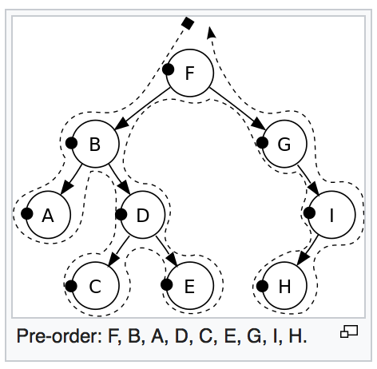
</kbd>
</p>


2. bootstraps_prep_tree.txt
Ignore this file because our tree did not have any bootstraps.


### Step 2: Get the CTU Matrix (count_tree.py)
Now that we have the ClaaTU tree, we can run the algorithm. This next script will take the OTU matrix. You should already have this matrix from microbiome analyses. 

This command has the form:
```markdown
python <path_to_ClaaTU/bin/count_tree.py> <otu_table> <prepped_tree> <out_file_path>
```

So we will run:
```markdown
python ../bin/count_tree.py otu.txt new_prepped_tree.tre ctus.txt
```

The output of this script is a clade taxonomic unit (CTU) table with internal node identifiers as columns and sample IDs as rows. We can see more of this file by typing ```cat ctus.txt```. These data can be used to examine differential abundance of clades across a case and control study. We have just done this part of the workflow:

<p align="center">
<kbd>

</kbd>
</p>

### Step 3: Get CTU Stats (clade_stat.py)
This step lets us get some clade stats. We pass the cladeStat for the prefix of our new files to be created. 

This command has the form:
```markdown
python <path_to_ClaaTU/bin/clade_stat.py> <prepped_tree> <tax_file> <out_file_path> -p <file_prefix>
```

So we will run:
```markdown
python ../bin/clade_stat.py new_prepped_tree.tre tax.txt . -p cladeStat
ls

```

We see after runing this command we have two new files.
A. ```cladeStat_clade_size.txt```
B. ```cladeStat_nodes2tax.txt```

##### 3A. cladeStat_clade_size.txt
Clade size contains two columns. The first column is the node name and the second column is the clade size. Clade size is defined as the number of tips that a particular clade has. Here is an example:

<p align="center">
<kbd>
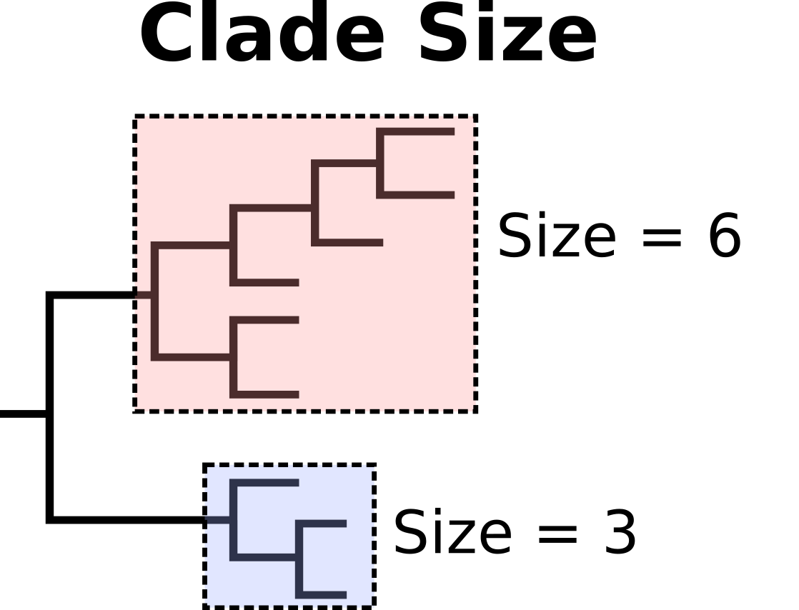
</kbd>
</p>

And an example of our file: ```head cladeStat_clade_size.txt```:
<p align="center">
<kbd>
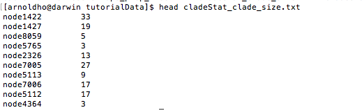
</kbd>
</p>

##### 3B. cladeStat_Nodes2tax.txt
One clade stat of interest to many researchers is taxonomic labels associated with each clade. This is particularly interesting if the clade is significantly different between case and control. This file contains a list of each clade followed by the taxonomic string of each OTU. This file will be used as a stepping stone for our next step of the process. 

### Step 4: Get CTU taxonomy (tax_parser.py)

This command has the form:

```markdown
python <path_to_ClaaTU/bin/tax_parser.py> <prefix>_node2tax.txt <outfile_name>
  ```

So we will run:
```markdown
python ../bin/tax_parser.py cladeStat_nodes2tax.txt tax_clades.txt
```

This step leaves us with a new file ```tax_clades.txt```. This is the taxonomy assigned to each clade. Claatu propagates taxonomic levels assigned to the tips up to the clade. The lowest shared taxonomic level of all tips is assigned to the clade. So for example, lets look at clade A. Clade A shares taxonomic labels of all tips down to the genus level. Thus, clade A is labeled with the genus name Ruminococcus. Clade D on the other hand, does not share taxonomic labels at the genus levels across all of the tips. However, all tips share the same taxonomic level at the family level, and thus clade D is labeled as Ruminococcaceae. It is important to note that in order for a taxonomic level to be assigned ALL tips must share that taxonomic label.

<p align="center">
<kbd>
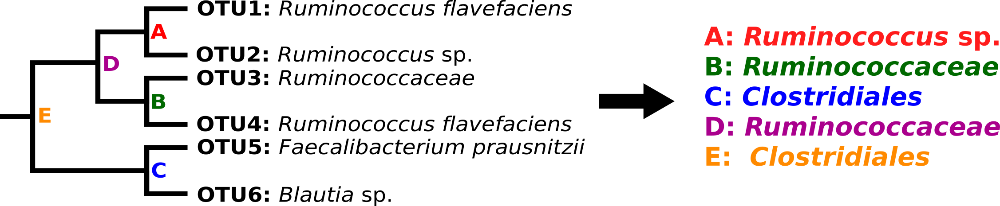
</kbd>
</p>

This step does require a ```tax.txt``` file that you can get from QIIME. If using a dada2 taxonomy file, check out the helper script ```dada2_tax_convert.pl``` in ```bin/``` to help you get the output in a usable format.

Lets take a look at how that practically words for our ```tax_clades.txt``` file. 
<p align="center">
<kbd>
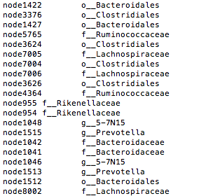
</kbd>
</p>

Here, we have a dictionary of nodes mapped to their clade label. We can see that the output shares the nomenclature of the QIIME taxonomy table, where "o__XXX" corresponds to a taxonomic level of order, "f__YYY" corresponds to the taxonomic level of family, and so on. 

### Step 5: Node_info.py
Next, we will get some more information about each clade. 

This command has the form:
```markdown
python <path_to_ClaaTU/bin/node_info.py> <prepped_tree> <out_file_path> -p <file_prefix>
```

So we will run:
```markdown
python ../bin/node_info.py new_prepped_tree.tre . -p node_info
```
This should produce three files.

##### node_info_levels.txt
This file contains a dictionary that maps each clade to its level, a measure of how nested it is. For example, lets take a look at this photo:

<p align="center">
<kbd>
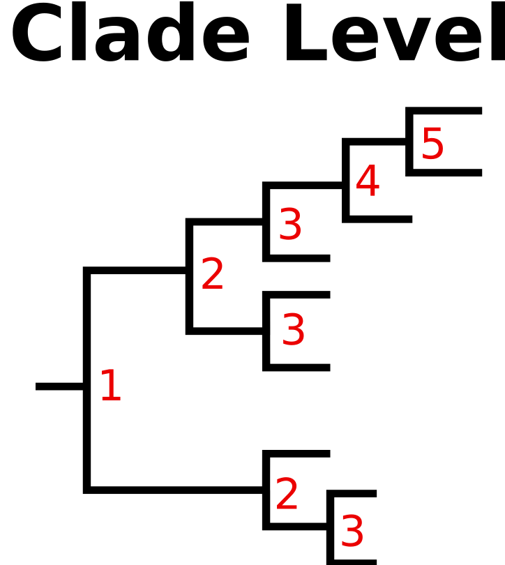
</kbd>
</p>

The level corresponds to how many other nodes are between clade X and the root. 

##### node_info_dist.txt
This file contains a dictionary that maps each clade to its distance from the root. 

##### node_info_dist_median.txt
This contains one number that corresponds to the median distance of all nodes.

### Step 6: Significance
Now, we may want to determine if a clade is more core than expected by random chance. Here, we define clade "coreness" as the percent of samples that a clade is found in. We may want to find "core clades" across all samples (step 6A) or clades that have high coreness in one group (i.e. healthy patients), but have low coreness in a different group (i.e. diseased patients) (setp 6B). To do this, we need to conduct a ptest. 

### Step 6A: Significance (ptest_tree.py)
The first step is to determine if we can find clades that are more core than expected by chance across our entire OTU table. This may take a couple of seconds to run depending on how many permutations you want to run. In this case, we have set the number of permutations to 100 (passed with the -p flag).

This command has the form:

```markdown
 python <path_to_ClaaTU/bin/ptest_tree.py> <otu_table.txt> <prepped_tree> <outfile.txt> -p <#permutations>
 ```
 
 So we will run:

```markdown
python ../bin/ptest_tree.py otu.txt new_prepped_tree.tre ptest.txt -p 100
```


At the start, Claatu calculates a *observed clade coreness* for each clade. *Clade coreness* is defined as the number of samples that that clade is found in divided by total number of samples. Then, for each permutation, claatu does the following:
1. Shuffles the tree tip to OTU labels. This means that each sample still has the same OTU count distribution, but different OTUs have been assigned to different tree tip labels.
2. Recalculates the ctu matrix (as we did in step 2 above) using the tree file.
3. For each clade, calculates a clade coreness of the shuffled matrix, giving a *shuffled clade coreness* for each clade.
At the end of the permutations, Claatu uses the difference between *observed clade coreness* and every *shuffled clade coreness* to calculate a zscore and p-value for every clade. 

Let's look at what this looks like in practical terms of our output files. This step outputs two files:

#### ptest.txt
* Column 1: The clade name
* Column 2: The observed clade coreness for each clade
* Column 3 through the end column: The shuffled clade coreness for each clade for each permutation.

### ptest.txt_stats.txt
* Column 1: The clade name
* Column 2: The *observed cladal coreness* for each clade
* Column 3: Mean of all *shuffled clade coreness* stats in ptest.txt
* Column 4: Zcore for every clade
* Column 5: The p-value for the ztest

### Step 6B: Significance by Group (ptest_tree.py)
It also might be interest if a particular clade is more core to one group of individuals (i.e. healthy) vs another (i.e. diseased), or any other experimental grouping of interest. In our tutorial dataset, our samples are from 22 different mammals. At the order level, each of these mammals fall into one of three taxonomic groups: Artiodactyla, Carnivora, or Primates. If we are interested in determining which clades may be core to say Primates, we can run this step.  

```markdown
head map.txt
head groupMap.txt
```
If we look in our groupMap.txt file:

```markdown
BigHornSheep	Artiodactyla
Okapi	Artiodactyla
Giraffe	Artiodactyla
Gazelle	Artiodactyla
Springbok	Artiodactyla
Urial	Artiodactyla
WartyPig	Artiodactyla
BushDog	Carnivora
Lion	Carnivora
BlackBear	Carnivora
```

We can see that the format for the file is shown. Note there are no headers in this file.
```markdown
sampleID1   groupLabel
sampleID2   groupLabel
...
sampleIDN   groupLabel
```

If given this group file, in lieu of performing the steps described in 6A above, Claatu will do the following.
1. Calculate the *observed group coreness* for each clade in each group. In our tutorial example, this means for every clade, we will have three coreness values calculated across each group (Primates, Arteriodactyla, Carnivores). The *observed group coreness* is simply the number of group samples a clade is found divided by the total number of samples that are a part of the group.
2. Shuffle the tip-to-OTU labels. For each permutation:
2A. The CTU matrix will be calculated for the new shuffled OTU matrix.
2B. A *shuffled group coreness* will be calculated for each clade from the suffled OTU table. 

The format of this command is:
```markdown
 python <path_to_ClaaTU/bin/ptest_tree.py> <otu_table.txt> <prepped_tree> <outfile.txt> -p <#permutations> -g <mapping_file>
```

So we will run this command. This will produce two output files

```markdown
python ../bin/ptest_tree.py otu.txt new_prepped_tree.tre groupPtest.txt -p 100 -g groupMap.txt
```


#### 1. groupPtest.txt
This file contains the following format:
* Column 1: The node ID number: followed by a ```nodeI_groupLabelJ```. This means that this line is for node i, with pvalues calculated for coreness of node i across samples of group j. 
* Column 2: This is the *observed group coreness* in the origional CTU.txt table for clade i across group j.
* Column 3 - end: These are the *shuffled group coreness* values for permutations 1, ..., p. 

So the head of our groupPtest.txt looks like this:

```markdown
exp_values 1  2 3 ...
node5256_Carnivora  0.33  0.66  0.833
```
This means that node 5256 was found in 33% of the animals that were mapped to the group Carnivora. 

##### 2. groupPtest.txt_stats.txt
This file contains the following format
* Column 1: The node ID number (clade i), followed by the group label for which this pTest is run for (group j).
* Column 2: The  *observed group coreness* of this clade for group j. 
* Column 3: The mean *shuffled group coreness* for clade i of group j.
* Column 4: The Z score of how observed differ from the shuffled observations.
* Column 5: The group pvalue for the coreness of clade i. 

