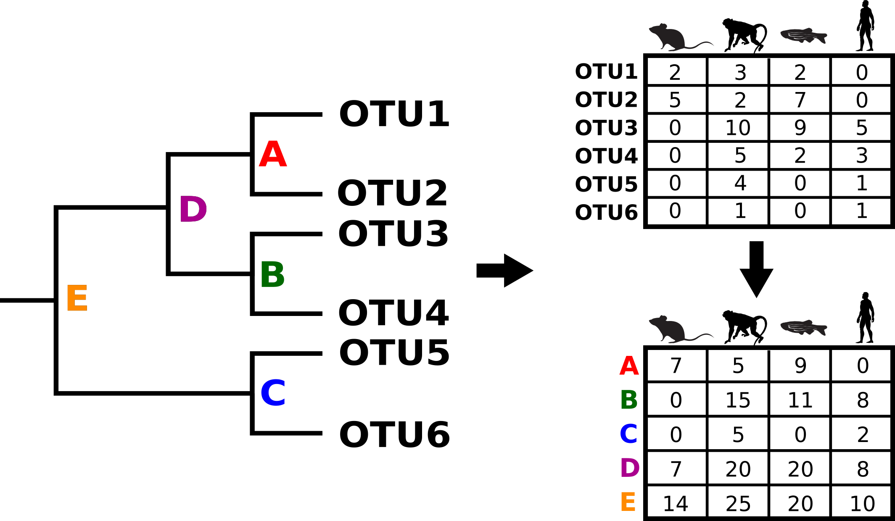

##  CLAATU Tutorial
Welcome to a tutorial on ClaaTU. This page is under construction to provide a tutorial guide for ClaaTU. The goals of this tutorial is for you to be able to (quickly) understand the theory behind ClaaTU, as well as be able to apply ClaaTU as a tool to your own data. 

### What is CLAATU?
Claatu is a new bioinformatic tool created in the Sharpton lab (https://github.com/chrisgaulke/Claatu). You see our new paper which implements this tool here (add link here). The ClaaTU Algorithm allows us to discover *Cladal Taxonomic Units*, or CTUs. If you've worked doing any microbiome analysis before, you are familiar with an Operational Taxonomic Unit (OTU) table that are output by many softwares such as QIIME, Mothur, or an Amplicon Sequence Variant (ASV) table output by Dada2. ClaaTU can work with any of these common software outputs to discover CTUs in your data. 

### What is a CTU?
A CTU is simply a monophylitic clade of organisms within a phylogentic tree. A CTU can occur at any point along the phylogenetic tree: very close to the tree tips, or very deep within the tree. For the purposes of the tutorial, think of the tree tips as the OTU names. Think of nodes within the tree as CTU names.


### Why use CTUs?
Incorporating phylogeny into the assessment of how microbial lineages are distributed across communities can identify monophyletic clades of microbes that collectively manifest an association with ecological factors. For example, the clade highlighted in red in the image above is universally present across all mammalian microbiome samples, indicating that the clade may have evolved a conserved trait that facilitated its ubiquitous distribution. If we were to consider this relationship at the OTU level (i.e., considering the tips of the tree as appropriate units), the redundancy of OTUs within this clade would obscure the detection of this relationship. On the other hand, if we were to consider the genus level, the aggregation of this clade with others that do not possess the trait would similarly obscure this relationship. The ClaaTU (Cladal Taxonomic Units) workflow uses data files produced by third party microbiome analysis software (e.g., QIIME, Mothur, DADA2, etc.) to identify and quantify the abundance of specific clades in a user provided phylogenetic tree. This allows us to examine the abundance of clades across the input tree from tip to root. Currently, ClaaTU is run as a collection of scripts and a workflow is provided below.

<p align="center">
<kbd>

</kbd>
</p>

### ClaaTU Algorithm Overview
<p align="center">
<kbd>

</kbd>
</p>
The idea behind ClaaTU is simple. ClaaTU uses two input files:
* An OTU or ASV table 
* A phylogenetic tree representing how OTUs (or ASVs) are related to one another.
* (Optional) a taxonomy file which labels each OTU with taxonomy

The output is a Cladal Taxonomic Unit Matrix m with the following properties:
* the row names correspond to the OTU sample names
* the column names correspond to each node of the phylogenetic tree.
* a m[i,j] corresponds to the sum of counts for each member of clade j found in sample i. 


### Install
First things first, lets install the software. 
```markdown
git git@github.com:arnold3/ClaaTU.git
```

### Dependencies
If you need to, you will have to install the following dependencies
1. [python (2.7.10)](https://www.python.org/downloads/)
2. [dendropy (4.0.2)](https://www.dendropy.org)
3. [scipy (0.13.0b1)](https://www.scipy.org/install.html)
4. [numpy (1.8.0rc1)](https://docs.scipy.org/doc/numpy/user/install.html)


### Files
Lets take a look at what the files are in the ClaaTU folder. Navigate to the location you downloaded Claatu to, then type: 
```markdown
cd Claatu-master
ls
```
You should see the following
```markdown
arc/  bin/  LICENSE.txt  test/  tutorialData/

```
Held within ```bin/``` are all the scripts which will carry out the Claatu algorithm. Held within `tutorialData/` are all of our tutorial files. This is where we are going to be working. Navigate to the `tutorialData` folder 
```markdown 
  cd tutorialData/
  ls
```
Here, we can see there are three files that you will need to run Claatu. Let's take a look at each one of them in a little more detail.


#### OTU Table

The first file that you will need is the OTU table that is output from QIIME. File format requirements:
- All entries must be tab separated.
- In standard QIIME output, there is text before the OTU table itself. To mark the beginning of the OTU table, QIIME adds a `#OTU ID` before the table. Yes, that is a `#OTU<space>ID<tab>`. This is important to note if you are not getting your OTU table from QIIME, but from another source.
- Column names are *sample IDs*
- Row names are *otu names*

So, now, lets take a look at our particular example:
```markdown
more otu.txt
```

<p align="center">
<kbd>

</kbd>
</p>


#### Bacterial tree
The second required file is a bacterial phylogenetic tree. File format requirements:
- newick format
- The tip labels must match the OTU labels in our otutable (`otu1, otu2, ... otuN`) exactly. Likewise, the names in the `.tre` file must exactly match those in the otu table.

```markdown
more bacterial.tre
```

<p align="center">
<kbd>

</kbd>
</p>

In our tutorial dataset, we see that we have a newick formated file, and that we have tree tips named similarly to the otu table. 

#### OTU Taxonomy table


### Step 1: Prep phylogenetic tree (prep_tree.py)

Our first step is to prep the phylogenetic tree that we've created for use in the Claatu algorithm. This step performs several things:
1. Labels Nodes. `prep_tree.py` will label nodes of the tree. These will be in the format `n_i` where `i` is the node number. These will be our clade names. Nodes will be labeled in a pre-traversal order. That is, the current node will be labeled before any of the children of the current node are labeled. This means root will be labeled as 1.
2. Midpoint rooting (Optional). We have the option of midpoint rooting the phylogenetic tree. This is helpful for bacterial trees because there is no appropriate outgroup to root the bacterial tree. Considerations for your own data: if you do not wish to midpoint root, simply don't pass the -mid flag to `prep_tree.py`. 
3. Update Bipartitions (Optional). Using this argument, we update the internal splits hash representation of the phylogenetic tree in dendropy. This has a time cost, and is not automatically called. However, if you are going to do any futher calculations (i.e. comparing trees, calculating statistics on trees, etc. it is good to call this.) 
4. Bootstraps (Optional). If the tree has bootstrap values, you can read more [here](https://github.com/chrisgaulke/Claatu/blob/master/bin/prep_tree.py). Our tree does not have bootstraps, so we will pass the `-nbs` flag to indicate no bootstraps.

 
Lets go ahead and run the command now and look at the output files
```python
python ../bin/prep_tree.py bacteria.tre -mid -up_bi -nbs
ls
```
This step creates two output files:
1. new_prepped_tree.tre
This is our new prepped tree with nodes labeled by dendropy. Lets go ahead and take a look at it:

<p align="center">
<kbd>

</kbd>
</p>

This is our bacterial tree. Each clade we are trying to get information on is labeled with a blue dot. Our `new_prepped_tree.tre` is now midpoint rooted. Additionally each parent only has two children, and each child only has one parent. Let's, take a closer look at the nodelabels on a subclade: 

<p align="center">
<kbd>

</kbd>
</p>

In Claatu, nodes are labeled by dendropy. We can see that dendropy has named the nodes in a *pre-traversal pattern* where the node number of the parent is guarenteed to be larger than that of a child. Note that dendropy does not use every integer in naming. Here is an example of a pre-traversal and the order that nodes are labeled.

<p align="center">
<kbd>

</kbd>
</p>


2. bootstraps_prep_tree.txt
Ignore this file because our tree did not have any bootstraps.


### Step 2: Get the CTU Matrix (count_tree.py)
Now that we have the ClaaTU tree, we can run the algorithm. This next script will take the OTU matrix. You should already have this matrix from microbiome analyses. 

```markdown
python ../bin/count_tree.py otu.txt new_prepped_tree.tre ctus.txt
```

The output of this script is a clade taxonomic unit (CTU) table with internal node identifiers as columns and sample IDs as rows. We can see more of this file by typing ```cat ctus.txt```. These data can be used to examine differential abundance of clades across a case and control study. 

### Step 3: Get CTU Stats (clade_stat.py)

### Step 4: Get CTU taxonomy (tax_parser.py)

### Step 5: Node_info.py

### Step 6A: Significance (ptest_tree.py)

### Step 6B: Significance by Group (ptest_tree.py)


